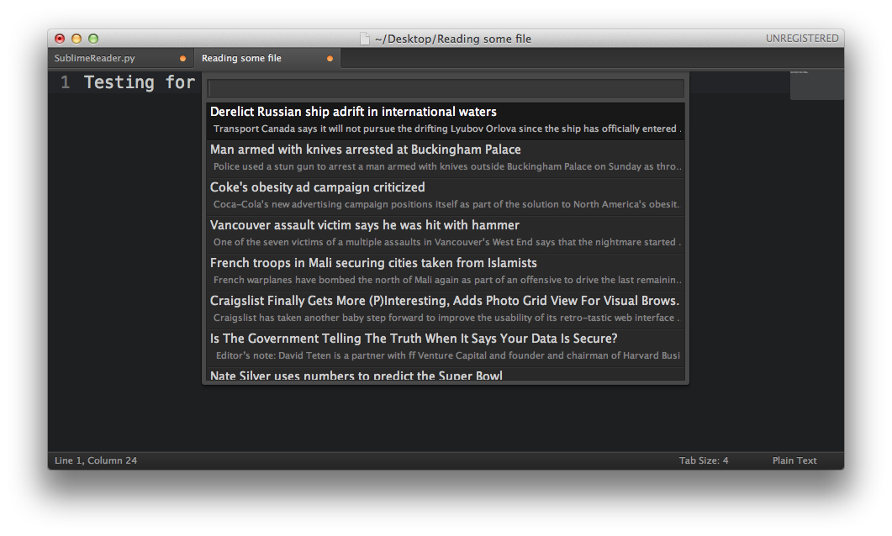

#Sublime Reader
A Google reader plugin for Sublime Text 2.  Check your news without leaving your favourite editor!

##Installation
###Sublime Package Control
If you are using [Sublime Package Control](http://wbond.net/sublime_packages/package_control) you can simply install Sublime Reader by searching for `Google Reader` in the package listing.
###Manual Install
Download Sublime Reader from [here](https://github.com/speg/SublimeGReader/archive/master.zip) and place the entire `SublimeGReader` directory into your `Packages` directory.
##Setting Up
After you install Sublime Reader you will need to provide your Google Reader credentials for authentication.  You can manually enter them in the `SublimeReader.sublime-settings` file (which you should copy to your `User` directory if you don't want it to be reset when the package is updated) or the plugin will prompt you the first time you try to use it:

##Using Sublime Reader
By default, Sublime Reader will check for new articles everytime you save a file:  
  
Once complete, it will display the unread count in the status bar:  
  
Press `super + shift + r` to display the list of articles at your conveience.
##Options
Sublime Reader has several options to let you customize the plugin to your liking:  

* `load_on_save` dislplays unread items on save
* `load_in_browser` opens the item in a new browser
* `always_check_for_new_items` will check for new items when you open the news feed
* `sublime_reader_login` your email address
* `sublime_reader_password` your password
* `show_content` displays a snippet display the title

##Credits
Many thanks go to the following:

* Jon Skinner, author of Sublime Text.  Without him none of this would exist!
* Jeffery Way, whose [course](http://net.tutsplus.com/articles/news/perfect-workflow-in-sublime-text-free-course/) convinced me to go all-in with Sublime.
* Matt Behrens, for creating and maintaining [libgreader](https://github.com/askedrelic/libgreader), the engine which drives this plugin.
* Will Bond, for creating and maintaing the [Sublime Package Control](http://wbond.net/sublime_packages/package_control).

